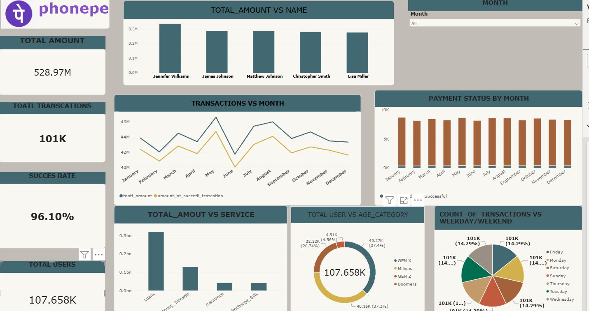

# 📊 PhonePe Transaction Analytics Dashboard

An interactive **Power BI dashboard** created to analyze PhonePe-style digital payment transaction data. The dashboard provides a clear view of transaction performance, payment status, customer demographics, service performance, and monthly trends.

---

## 🖼️ Dashboard Preview

> Add your Power BI dashboard screenshot to this repository and replace the image name below.



---

## 🎯 Project Objective

The objective of this project is to analyze digital payment transactions and identify meaningful business insights related to:

- Transaction volume and value
- Payment success and failure
- Monthly transaction trends
- Service-wise transaction amounts
- Customer age-group distribution
- High-value customers
- Day-wise transaction activity

The dashboard is designed to help business teams quickly understand transaction performance and identify areas for improvement.

---

## 🛠️ Tools & Technologies

- **Power BI**
- **DAX**
- **Data Cleaning & Transformation**
- **Data Visualization**
- **Business Intelligence**

---

## 📌 Key KPIs

| KPI | Value |
|---|---:|
| 💰 Total Transaction Amount | **₹528.97M** |
| 🔄 Total Transactions | **101K** |
| 👥 Total Users | **107.66K** |
| ✅ Transaction Success Rate | **96.10%** |

---

## 📈 Dashboard Analysis

### 1. Transaction Performance
The dashboard tracks overall transaction amount and transaction volume to understand the scale and performance of digital payments.

### 2. Monthly Trends
Monthly analysis shows fluctuations in transaction activity. **May records a major peak, while June shows a noticeable decline**, highlighting the importance of monitoring seasonal and monthly changes.

### 3. Payment Status
Successful transactions dominate the payment-status distribution, resulting in a strong **96.10% transaction success rate**. Failed and pending transactions can still be analyzed to identify opportunities for improving payment reliability.

### 4. Service Performance
**Loans** contribute the highest transaction amount at approximately **₹320M**, followed by **Money Transfer** at approximately **₹130M**. Insurance and Recharge/Bills contribute comparatively lower amounts.

### 5. Customer Demographics
**Gen X and Millennials** are the largest customer segments, each representing roughly **37%** of the user base. This indicates that these groups are important target segments for customer engagement and retention strategies.

### 6. High-Value Users
The top users by transaction amount generate values in the approximate range of **₹280K–₹330K**, helping identify customers with high transaction value.

### 7. Day-wise Transactions
Transactions are relatively evenly distributed across the days of the week, with each day contributing approximately **14%** of total transactions.

---

## 💡 Business Insights

- A **96.10% success rate** indicates strong overall payment reliability.
- **Loans** are the strongest-performing service by transaction amount.
- **Gen X and Millennials** form the largest user segments.
- Monthly transaction performance varies considerably, with a strong peak in **May** and a decline in **June**.
- High-value customers represent an opportunity for targeted retention and engagement strategies.
- Since payment failures still occur, analyzing failure reasons could further improve customer experience.

---

## 🚀 Business Recommendations

1. **Reduce payment failures** by identifying the major causes of unsuccessful transactions.
2. **Focus on Gen X and Millennials** with targeted offers and engagement campaigns.
3. **Expand high-performing loan services** and investigate the factors driving their strong transaction value.
4. **Analyze monthly fluctuations**, especially the May peak and June decline, to improve transaction consistency.
5. **Develop high-value customer strategies** such as personalized offers and loyalty programs.
6. Monitor payment status trends regularly to maintain and improve the transaction success rate.

---

## 📊 Dashboard Features

- KPI Cards
- Monthly Transaction Trend
- Payment Status Analysis
- Service-wise Amount Analysis
- Age Group Analysis
- Top 5 Users by Transaction Amount
- Day-wise Transaction Analysis
- Month Slicer for Interactive Filtering

---

## 🔢 Key DAX Measures

Example measures used in the dashboard:

```DAX
Total Amount = SUM('Transactions'[total_amount])

Total Transactions = COUNT('Transactions'[transaction_id])

Total Users = DISTINCTCOUNT('Transactions'[user_id])

Success Rate =
DIVIDE(
    CALCULATE(
        COUNT('Transactions'[transaction_id]),
        'Transactions'[payment_status] = "Successful"
    ),
    COUNT('Transactions'[transaction_id]),
    0
)
```

> Update the table and column names in the DAX formulas if your dataset uses different names.

---

## 📂 Repository Structure

```text
PhonePe-Transaction-Analytics/
│
├── 📊 PhonePe_Transaction_Analytics.pbix
├── 🖼️ dashboard.png
├── 📄 README.md
└── 📁 Dataset/
    └── transactions.csv
```

---

## 📌 Project Outcome

This project demonstrates the ability to transform transaction data into an **interactive business intelligence dashboard** and communicate data-driven insights through KPIs, trends, customer segmentation, and service-level analysis.

---

## 👨‍💻 Skills Demonstrated

**Power BI | DAX | Data Analysis | Data Visualization | Dashboard Design | Business Insights**

---

⭐ **If you find this project useful, consider giving the repository a star!**
